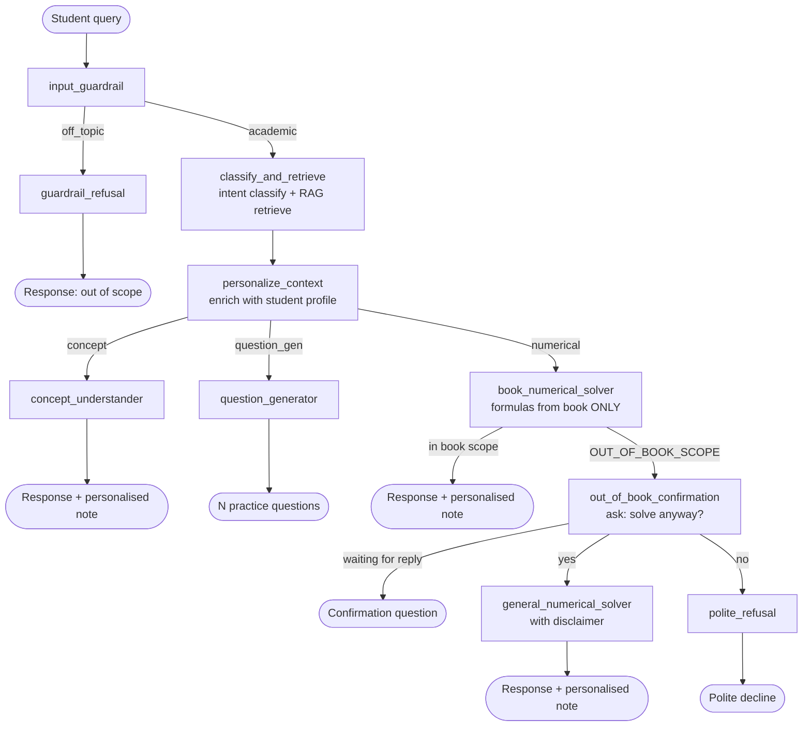

# Rootwise — LangGraph Educational RAG Agent

A multi-node agentic RAG pipeline that tutors school students strictly from their own textbook chapters — built with **LangGraph**, a **parent-child hierarchical retriever**, and per-student **personalisation**, all gated by guardrails that keep the tutor on-syllabus and refuse to hallucinate formulas.

This is the LangGraph backend for [Rootwise](https://github.com/Namangarg-01/RootWise), built during my AI Engineer internship at RootVestors.

## Architecture



*(Renders automatically on GitHub. Node names above match the actual function names in [`main.py`](CodeBase/RAGPipeline/Code/main.py) 1:1.)*

## How it works

**1. Input guardrail** — an LLM call classifies the query as `academic` or `off_topic` *before* any retrieval or solving happens. Off-topic queries are hard-blocked with zero further LLM calls.

**2. Classify & retrieve** — the query is classified into `concept`, `numerical`, or `question_gen`, and the hierarchical retriever pulls the most relevant textbook sections.

**3. Personalize context** — every path (concept, numerical, question generation) is enriched with the student's profile (weak topics, learning style, past errors, interests) *and* the recent conversation history before it reaches a solver. This context is used to flavour explanations and practice questions, resolve follow-ups, and append a closing study note.

**4. Type-specific solving:**
- `concept_understander` — explains a concept using *only* the retrieved textbook context.
- `book_numerical_solver` — solves numericals using *only* formulas explicitly present in the retrieved context. If no matching formula exists, it returns `OUT_OF_BOOK_SCOPE` instead of guessing.
- `question_generator` — generates a configurable number of practice questions (parsed from the query, e.g. "give me 5 questions"), pulled from real book numericals and flavoured with the student's interests, with an auto-scaled easy/medium/hard difficulty split.

**5. Out-of-book confirmation loop** — if a numerical falls outside the book's scope, the agent asks the student whether to solve it anyway using general knowledge. The caller (e.g. the Streamlit app) stores the pending query and re-invokes `run_query` with `user_confirmed_oob=True/False` once the student answers — the graph re-runs end-to-end and routes to `general_numerical_solver` (with an explicit "beyond your textbook" disclaimer) or `polite_refusal`.

**6. Personalised note** — every successful answer ends with a short "Personalised Note" — one sentence flagging overlap with a weak area, one study tip matched to the student's learning style, and a warning about a relevant past error pattern.

**7. Conversation memory** — `run_query` accepts a `chat_history` list (prior turns) that flows into the guardrail, intent classifier, retrieval query, and every solver — so "give me an example of that" or "solve another one like the last" resolve correctly instead of being treated as standalone, context-free queries. The caller owns persisting this list (`streamlit_app.py` does it via `st.session_state.messages`); `run_query` itself is stateless per call and never mutates or reads state from the `MemorySaver` checkpointer across calls — each invocation re-runs the full graph from `input_guardrail`, using whatever `chat_history` and `user_confirmed_oob` you pass in.

## RAG: parent-child hierarchical retrieval

Textbook PDFs are ingested into a 3-level hierarchy:

```
Level 0 — Chapter
Level 1 — Section        (e.g. "8.2 First Law of Motion")   ← parent, returned as context
Level 2 — Semantic chunk (≤512 tokens)                       ← child, what gets embedded
```

Only Level-2 leaf chunks are embedded and searched (Chroma + `all-mpnet-base-v2` sentence embeddings, MMR for diversity). At query time, retrieved leaves are expanded and deduplicated to their Level-1 parent sections, so the LLM gets full, coherent passages instead of fragmented chunks — while search itself stays precise at the leaf level.

An `is_context_sufficient` scope check (minimum doc count + average relevance score) decides whether the book actually covers the query, driving the out-of-book confirmation flow above.

## Robustness

- **LLM calls retry on transient failures** — rate limits and connection errors get exponential-backoff retries (3 attempts); non-retryable errors (bad model, bad key) fail fast with a clear message instead of hanging.
- **Empty LLM completions are treated as failures and retried**, not silently shown to the student as a blank answer.
- **`run_query()` never raises to the caller** — any failure (LLM down, retriever/embeddings error, anything unexpected) degrades to an apologetic response instead of crashing the graph invocation or the Streamlit process.
- **Empty/whitespace-only queries are rejected before hitting the LLM.**
- The Streamlit UI has its own last-resort exception handler around every `run_query()` call, so a bug in the pipeline can't wipe out an in-progress conversation.
- **Math renders as actual LaTeX, not raw text.** Despite an explicit prompt instruction, models reliably default to `\( \)` / `\[ \]` (their strongest LaTeX training prior) instead of the `$...$` / `$$...$$` Streamlit's KaTeX renderer requires — every response is normalized before display, including a safety net for the rare case where a model mixes delimiter styles within one equation.

## Tech stack

Python, LangGraph, LangChain, Groq (`openai/gpt-oss-120b`), ChromaDB, HuggingFace sentence-transformers (`all-mpnet-base-v2`), PyMuPDF, Streamlit.

## Try it live

A chat UI is included and ready to demo — [`streamlit_app.py`](CodeBase/RAGPipeline/Code/streamlit_app.py). The vector store for all three chapters (Motion, Force and Laws of Motion, Gravitation) is pre-built and committed (`chroma_db/`), so there's no ingestion step needed to try it.

```bash
pip install -r requirements.txt
```

Create a `.env` file in the repo root with:

```
GROQ_API_KEY=your_groq_api_key
HF_TOKEN=your_huggingface_token
```

Run the chat app:

```bash
cd CodeBase/RAGPipeline/Code
streamlit run streamlit_app.py
```

**Deploying on Streamlit Community Cloud:** point the app at `CodeBase/RAGPipeline/Code/streamlit_app.py`, and add `GROQ_API_KEY` / `HF_TOKEN` under the app's Secrets — no `.env` file needed there, the app reads secrets directly.

## Programmatic usage

To ingest a new textbook chapter (only needed if you add a chapter beyond the three already included):

```python
from ingest import ChapterMeta, ingest
ingest(pdf_path="path/to/chapter.pdf", chapter_meta=ChapterMeta(
    book_name="Science - Class IX", chapter="Chapter 10",
    chapter_title="Work and Energy", topic="Energy", start_page=1, end_page=999,
))
```

Then query the agent directly:

```python
from main import run_query

result = run_query("A 5 kg object accelerates at 3 m/s². What is the force?", user_id="student_42")
print(result["response"])

# If the answer comes back OUT_OF_BOOK_SCOPE, resume with the student's choice:
result = run_query("A 5 kg object accelerates at 3 m/s². What is the force?",
                    user_id="student_42", user_confirmed_oob=True)
```

## Project structure

```
CodeBase/RAGPipeline/
├── Files/                  # Source textbook PDFs
└── Code/
    ├── main.py             # AgentState, all graph nodes, routing, graph assembly
    ├── retriever.py         # HierarchicalRetriever — parent-child retrieval + MMR
    ├── ingest.py             # PDF → chapter/section/chunk hierarchy → vector store
    ├── context_builder.py    # Formats retrieved docs into cited, token-budgeted context
    ├── streamlit_app.py       # Chat UI — self-contained, deployable standalone
    ├── chroma_db/              # Pre-built vector store (all 3 chapters, ~2.4 MB)
    └── parent_store.json       # Pre-built parent-section store for context expansion
```
